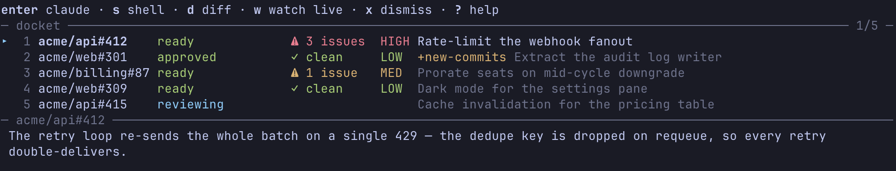

# docket

**Pre-runs Claude Code's `/code-review` on every PR waiting for your review.**

<!-- Capture: run `docket` with a few entries in the queue (mixed verdicts, one
     highlighted so the panel shows a headline), terminal ~120x35, no real PR
     titles you'd rather not publish. Save as docs/assets/queue.png. -->


docket watches GitHub for PRs where your review is requested and reviews each
one headlessly, in an isolated worktree of your local clone — so by the time
you sit down, a finished review session is waiting to be resumed. Reviews
never write anything to GitHub; the output is a queue on your machine, one
verdict per PR. The name is the metaphor: a docket is the list of cases
waiting on a judge, and every entry here is a case awaiting your judgment.

## Install

```sh
brew install mrgawrys/tap/docket
```

Or from source (needs [bun](https://bun.sh)):

```sh
git clone https://github.com/mrgawrys/docket && cd docket && ./install.sh
```

You'll also need:

- macOS — scheduling uses launchd, notifications use osascript
- `gh`, authenticated
- the [`claude`](https://code.claude.com) CLI
- a local clone of every repo you want reviewed
- the code-review plugin —
  `claude plugin install code-review@claude-plugins-official` — unless you
  set a custom [`review_prompt`](docs/configuration.md#review_prompt) that
  doesn't run `/code-review`

`docket doctor` checks all of this and prints a fix for anything missing.

## Quickstart

1. **`docket`** — with no config yet, or one still holding the starter
   placeholders, it offers to set one up: a few questions right there in the
   terminal, or a claude-guided session that does the discovery for you. The
   quick route asks which GitHub account (of the ones `gh` is logged in as),
   whose PRs to watch — your orgs, and your own login for personal repos —
   and where your clones live, scanning three levels down for repos it can
   map. It writes the config and ends on doctor's ✓/✗ list, then the command
   you asked for carries on. When it comes up short — `gh` lists no orgs, the
   scan finds nothing — it offers to hand the rest to claude instead.
   Declining the offer leaves you steps 2 and 3, the by-hand route (which is
   also what `docket doctor` leaves you, and what the poller gets when nobody
   is there to ask).
2. **Edit `~/.config/docket/config.json`.** Two keys are required:

   ```json
   {
     "orgs": ["your-github-org"],
     "repos": {
       "your-github-org/api": "/Users/you/dev/api"
     }
   }
   ```

   `orgs` is polled for PRs where your review is requested; `repos` maps each
   repo to its local clone. Everything else has a sensible default — see the
   [configuration reference](docs/configuration.md).
3. **`docket doctor`** — it checks the whole review chain (config, clones, gh
   auth, claude, plugin). Every line should be ✓.
4. **`docket poll --dry-run`** — read-only; lists what would be reviewed.
   **Everything listed gets reviewed (and billed) once the poller is on**, so
   seed a pre-existing backlog as done first:

   ```sh
   jq '."ORG/REPO#N" = {status: "done", note: "seeded"}' state.json > s && mv s state.json
   ```

   (state lives in `~/.local/state/docket/`).
5. **`docket on`** — loads the launchd job. Run it from your normal shell,
   with your version manager active: the job inherits that PATH, so polled
   reviews see the same toolchain you do. Re-run it after changing your PATH.
   `docket status` to confirm.

From here, reviews arrive on their own — you get a macOS notification as each
one finishes.

## Day to day

`docket` opens the queue. Each row carries the review's verdict at a glance —
how many issues it would flag, and the risk it graded the PR — and the panel
under the list shows the highlighted PR's headline finding. It is a triage
screen: `enter` is how a review actually gets read.

```
j/k ↑/↓  move          enter  claude       s  shell      d  diff
D  denials             a  apply (denials view)
h  hand off group to claude (denials view)
H  hand off batch to claude (denials view)
w  watch live          r  retry            x  dismiss    K  kill
p  poll                S  sync             ?  help       q  quit
```

`enter` resumes the Claude session where the review ran, with full context —
ask follow-ups, push back, dig into a finding. `s` and `d` open the PR's
worktree: a shell in it, or its diff in your diff tool (configurable via
[`openers`](docs/configuration.md#openers)). `x` dismisses an entry and
removes its worktree; `K` kills a running review before it burns more tokens.
A verb this machine cannot run is greyed out with the reason shown, rather
than failing after the keypress.

The rest of the CLI:

| Command | What it does |
| --- | --- |
| `docket review ORG/REPO#N ["note"]` | force-review any PR (URLs work too); the note is handed to the reviewer as extra context |
| `docket watch [ORG/REPO#N]` | follow a running review live; without an argument, follow the poller log |
| `docket sync` | reconcile with GitHub now: merged/closed PRs are dismissed, PRs you already reviewed show your verdict |
| `docket dismiss ORG/REPO#N` | mark an entry done without reviewing it |
| `docket doctor` | check the whole setup and print fixes |
| `docket on` / `off` / `status` | manage the launchd poller |
| `docket log [N]` | tail the poller log |

## Denied permissions

Reviews run headless on a read-only tool allowlist, so a call outside it is
denied and the run carries on without whatever it asked for. Those denials are
read back off the run log when the review ends — for failed runs as much as
finished ones — and kept with the entry.

A `⊘ 5` chip on a row is how many calls that run had denied. `D` opens the
denials view: one block per allowlist entry that would have covered them, how
many calls each covers, and up to three of the commands turned away.

`a` adds the selected suggestion to
[`extra_allowed_tools`](docs/configuration.md#extra_allowed_tools), so the next
review has it. Two kinds of group never get that one keypress:

- **write-shaped** ones — `git push`, most `gh` verbs, `rm`, an interpreter
  like `sh` or `python` — read "conflicts with docket's read-only stance — add
  manually or hand to claude". Allowing them wholesale gives up the guarantee
  that an unattended review changes nothing, so they stay a deliberate edit.
- ones **already in the allowlist** read "rule exists but didn't match": the
  call was denied anyway — a `*` in the middle of a pattern, a prefix the call
  never matched — so adding the same rule again fixes nothing.

`h` hands the selected group to an interactive claude session, `H` the whole
batch. It starts in the repo's local clone (so the key needs one) and carries
the groups, your config path, the effective allowlist and the run log. The
standing order is research only: propose options, change nothing. The session
runs in claude's default permission mode, so anything it does want to change
prompts you, not docket.

## Configuration

Everything lives in `~/.config/docket/config.json`. Beyond `orgs` and
`repos`, the keys you're most likely to want:

- `review_prompt` — swap the default `/code-review` run for any review task
  you can phrase as a prompt
- `openers` — which shell and diff tool the queue's `s` and `d` keys launch
- `gh_account` — pin polling to one `gh` account, so `gh auth switch` can't
  silently blind the poller
- `ignored_teams` — skip PRs that only reach you through a team you're not
  really reviewing for
- `claude_env` / `claude_config_dir` — control the environment every claude
  invocation runs with

The full reference, with semantics and defaults for every key, is in
[docs/configuration.md](docs/configuration.md).

## How it works

Each poll asks GitHub for PRs awaiting your review and hands every new one to
its own detached runner, which runs `claude -p` headlessly in an isolated git
worktree with a locked-down, read-only tool allowlist. Runners survive the
poll process — Ctrl+C never cancels an in-flight review — and a finished
review becomes a row in the queue, its Claude session kept for you to resume.
The clone's working copy is never touched, and nothing is ever posted to
GitHub. Details, including the entry lifecycle and where state lives, are in
[docs/how-it-works.md](docs/how-it-works.md).

## Development

- `bun test` — run the test suite (fully mocked: no network, no tokens)
- `bun run dev` — run the CLI from source, e.g. `bun run dev status`
- `bun run build` — compile the `docket` binary into `dist/`
- `bun run format` — format with Biome (`format:check` is enforced in CI)

Releases are pushed tags; see [packaging/README.md](packaging/README.md).
